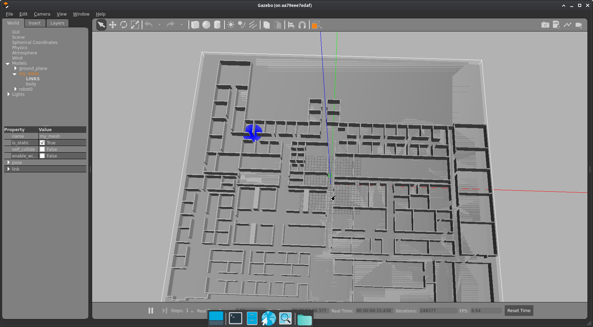
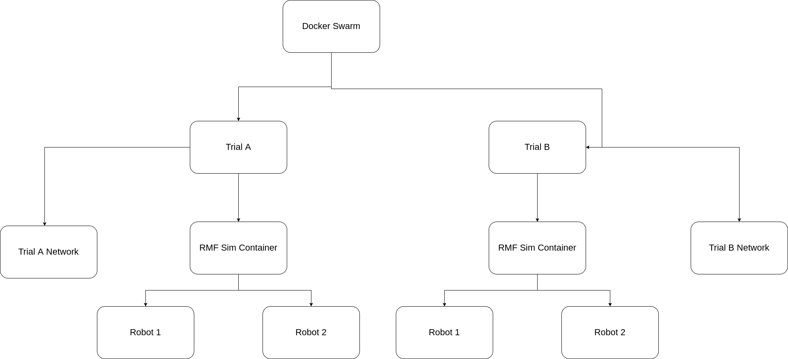
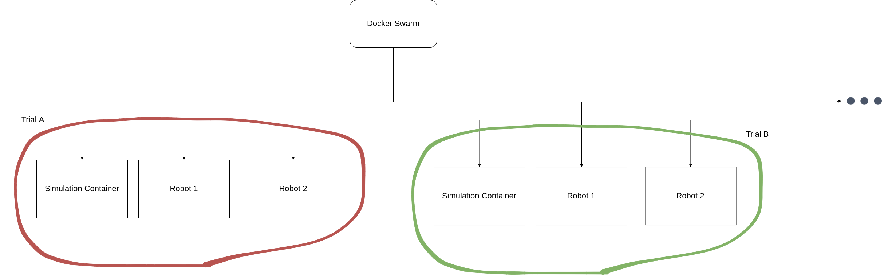

# Generic Robotics Simulator with Docker

Library for implementing Distributed Robotics experiment trials with Docker.

## Dependencies

Install all python dependencies listed on requirements.txt

## Usage

This library provides an acessible interface for integrating different containers as plugins in a distributed system using docker.

Integrate different aspects of your ros 2 simulation, such as RVIZ, Gazebo, Nav2 and each robot as a separate container.
    Or organise your simulations into trials to be run distributively.

## Examples

Run a gazebo simulation with a turtlebot3

```python
import docker
from plugins.simulators.gazebo import Gazebo
from plugins.robots.turtlebot3 import Turtlebot3
from plugins.networks.ros2_network import ROS2Network


client = docker.from_env()
network = ROS2Network(docker_client=client, name="ros2")
sim = Gazebo(docker_client=client, headless=True, auto_remove=True, network=network)
robot = Turtlebot3(docker_client=client, tag="robot1", auto_remove=True, network=network)

network.build()
sim.build()
robot.build()

sim.run(network_mode=False)
robot.run()
```

Run one of the RMF_Gazebo demos

```python
import docker
from plugins.simulators.rmf_gazebo_simulator import RMFGazebo

client = docker.from_env()
sim = RMFGazebo(client, headless=True)
sim.build()
sim.run()
```

Run a complete turtlebot3 simulation with nav2 and gazebo with logging.

```python
import docker
from plugins.simulators.gazebo import Gazebo
from plugins.robots.turtlebot3_nav2 import Turtlebot3withNav2
from plugins.robots.turtlebot3 import Turtlebot3
from plugins.networks.ros2_network import ROS2Network
from plugins.ros2.rviz import RVIZ
from plugins.loggers.docker_logger import DockerLogger
from core import pose


def test_turtlebot3withnav2():
    return
    client = docker.from_env()
    network = ROS2Network(client, name="ros2")
    sim = Gazebo(client, headless=False, auto_remove=True, network=network, path_to_world="/opt/ros/humble/share/turtlebot3_gazebo/worlds/turtlebot3_world.world")
    sim._add(DockerLogger(target='', write_to_file=True, filename='sim.log', timeout=300))
    ps = pose.Pose()
    ps.position.x = -2
    ps.position.y = -0.5
    ps.position.z = 0.1
    robot = Turtlebot3withNav2(client, robot_name="turtlebot", robot_namespace="turtlebot", auto_remove=True, network=network,
                               initial_pose=ps, use_rviz=True)
    robot._add(DockerLogger(target='', write_to_file=True, filename='robot.log', timeout=300))
    sim.add_model_path(container=robot, path="/opt/ros/humble/share/turtlebot3_gazebo")
    ps = pose.Pose()
    ps.position.x = 2
    ps.position.y = -1
    ps.position.z = 0.1
    robot2 = Turtlebot3withNav2(client, robot_name="turtlebot2", robot_namespace="turtlebot2", container_name="turtlebot2",
                                auto_remove=True, network=network, initial_pose=ps, use_rviz=True)
    robot._add(DockerLogger(target='', write_to_file=True, filename='robot2.log', timeout=300))

    network.build()
    sim.build()
    robot.build()
    robot2.build()

    sim.run(network_mode=False)
    robot.run()
    robot2.run()
```

You can find more examples in our tests directory.

## Images

### Simulation Example
 

### Trial structure



